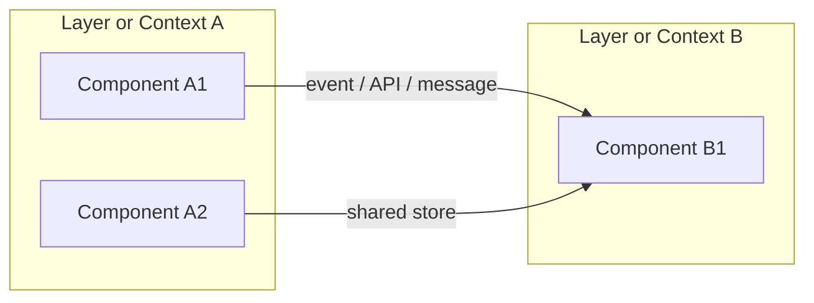
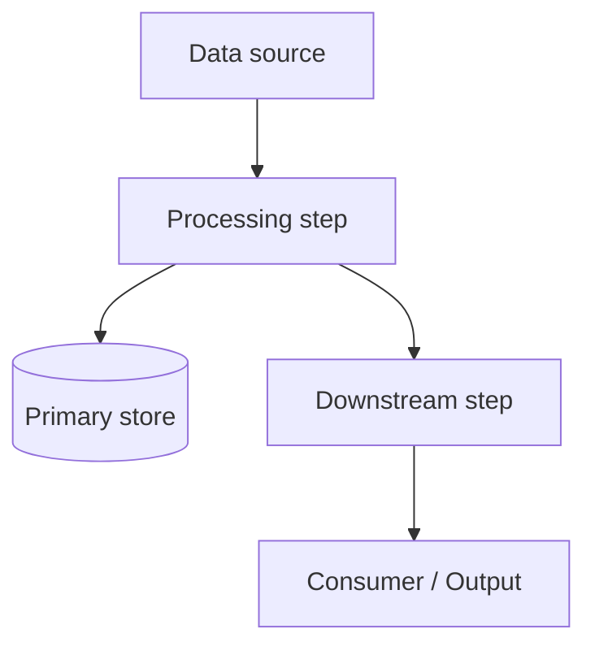
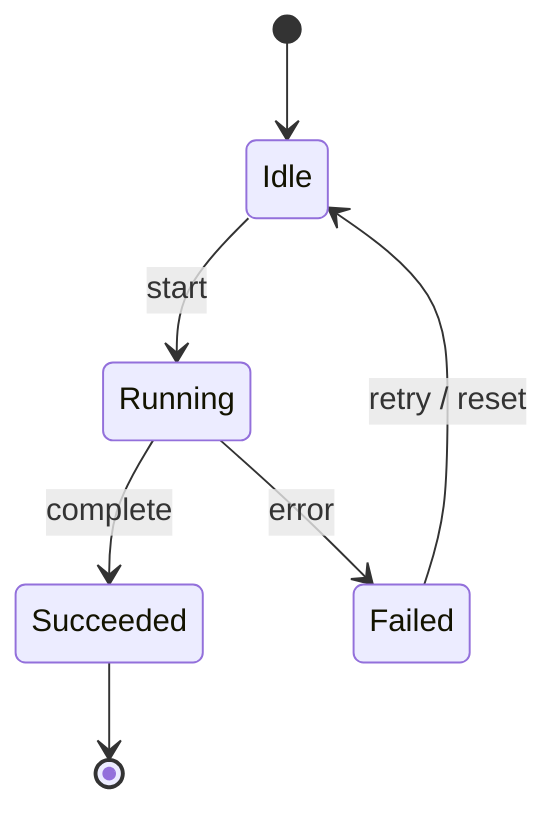
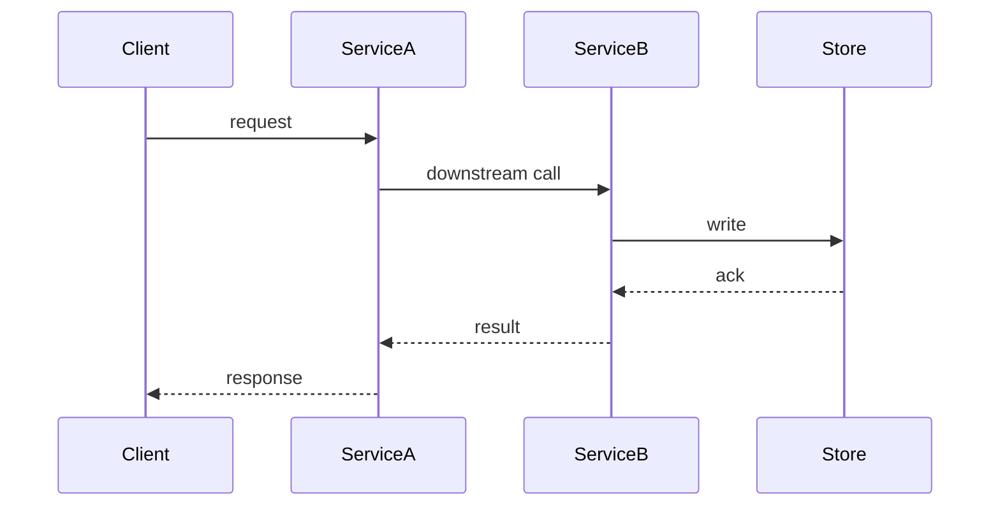

# Diagram cookbook — Mermaid patterns

Copy a recipe, then correct it against current code before committing. Always render-check — Mermaid syntax errors fail silently in plain Markdown and a broken diagram is worse than none.

Conventions:
- Use **stable identifiers** (module names, type names, message/event names, store names) as labels. They survive refactors; line numbers do not.
- One altitude per diagram. If it needs more than ~15 nodes, split it.
- Keep node text short; put detail in the surrounding prose.

---

## 1. Component / context map (who talks to whom)

Use this for the high-level “who talks to whom” view. Label edges with the actual communication mechanism.

---

## 2. Data flow

Mark which artifacts land in which store or ownership boundary.

---

## 3. State machine (one important lifecycle)

Pick **one** load-bearing lifecycle. Do not try to draw every state in the system at once.

---

## 4. Sequence (one representative end-to-end path)

Use this to reveal hops, contracts, and failure points that the component map hides.

---

## General tips

- Prefer `flowchart` for structure and data movement; `sequenceDiagram` for interaction; `stateDiagram-v2` for lifecycles.
- If a diagram becomes dense, extract a second diagram at a different altitude rather than cramming more nodes.
- After editing, re-render mentally or with a Mermaid previewer to catch syntax errors before the doc is committed.
